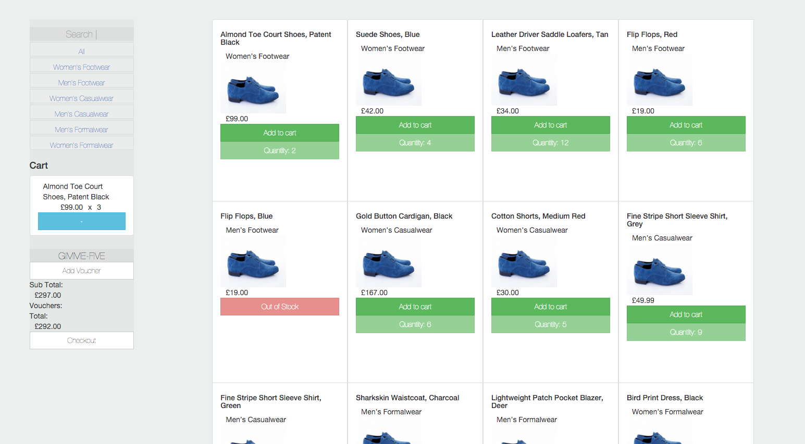

[](https://travis-ci.org/NULL-OPERATOR/blue-suede-shoes) [](https://codeclimate.com/github/NULL-OPERATOR/blue-suede-shoes) [](https://coveralls.io/github/NULL-OPERATOR/blue-suede-shoes?branch=master)

```

```

# BLUE SUEDE SHOES




## About
##### Shopping simulator
Using AngularJs/Html/Css


## User stories


1. As a User,
 I can add a product to my shopping cart.
2. As a User,
 I can remove a product from my shopping cart.
3. As a User,
 I can view the total price for the products in my shopping
 cart.
4. As a User,
 I can apply a voucher to my shopping cart.
5. As a User,
 I can view the total price for the products in my shopping cart with discounts applied.
6. As a User,
 I am alerted when I apply an invalid voucher to my shopping
cart.
7. As a User,
 I am unable to Out of Stock products to the shopping cart.


There are also discount vouchers available that can be redeemed. The discount vouchers are as follows:

- £5.00 off your order
- £10.00 off when you spend over £50.00
- £15.00 off when you have bought at least one footwear item and spent over £75.00


The prioritised list of user stories is as follows:
As a User I can view the products and their category, price and availability information.

## Current Features


node.js and npm required - get them from [http://nodejs.org/](http://nodejs.org/).

## To run
clone & cd into the repo
```
git clone https://github.com/NULL-OPERATOR/blue-suede-shoes.git
cd blue-suede-shoes
```
install dependencies
(npm install will run bower)
```
npm install
npm run update-webdriver
```
now visit
```
http://localhost:8000/app
```
launch the server
```
http-server -a localhost -p 8000
```

## Layout


## Tests
are written in [Jasmine][jasmine], which will run with the [Karma Test Runner][karma].
```
npm test
```
## e2e
written in [Jasmine][jasmine]. These tests are run with the [Protractor][protractor]

```
npm run protractor
```


## Pending Improvements


[git]: http://git-scm.com/
[bower]: http://bower.io
[npm]: https://www.npmjs.org/
[node]: http://nodejs.org
[protractor]: https://github.com/angular/protractor
[jasmine]: http://jasmine.github.io
[karma]: http://karma-runner.github.io
[travis]: https://travis-ci.org/
[http-server]: https://github.com/nodeapps/http-server
